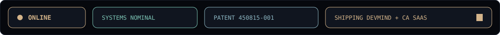
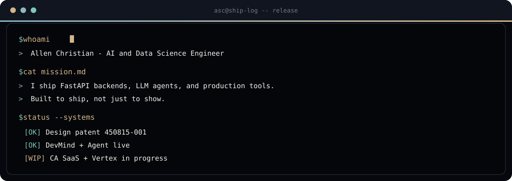

<!-- ASC // SHIP LOG — self-hosted SVGs only (zero broken XML) -->

 

  

 

 

 

## Dossier

 

| Signal | Detail |
|:--|:--|
| **Now** | Shipping **DevMind**, building **CA SaaS**, iterating **Vertex**, and keeping the [portfolio](https://portfolio-demo-tan-six.vercel.app/) sharp |
| **Always** | Clean APIs · measurable results · end-to-end delivery |
| **North star** | Machine Learning Engineer who ships systems people actually use |

 

 

## Systems shipped

Production-shaped work from the [portfolio](https://portfolio-demo-tan-six.vercel.app/) — products, a patent, and honest learning series.

<table>
<tr>
<td width="50%" valign="top">

### [DevMind AI](https://devmind-ai-topaz.vercel.app/)
`LIVE PRODUCT`

AI developer toolkit — code review, bug hunt, docs, complexity, commit messages. Designed, deployed, maintained end to end.

`FastAPI · Groq · React · Vercel`

[Live](https://devmind-ai-topaz.vercel.app/) · [GitHub](https://github.com/allen745/devmind-ai)

</td>
<td width="50%" valign="top">

### [DevMind Agent](https://devmind-agent.onrender.com/)
`REASONING AGENT`

Multi-step repo intelligence agent — fetch, analyze, cross-file patterns, Foundry IQ synthesis. Microsoft Agents League build.

`FastAPI · LLaMA 3.3 · Foundry IQ`

[Live](https://devmind-agent.onrender.com/) · [GitHub](https://github.com/allen745/DEVMIND-AGENT)

</td>
</tr>
<tr>
<td width="50%" valign="top">

### [CA SaaS](https://github.com/allen745/ca-saas)
`B2B · IN PROGRESS`

Platform for practicing Chartered Accountants — clients, AI document reading, notice drafting, anomaly flags.

`FastAPI · PostgreSQL · React · Groq`

[GitHub](https://github.com/allen745/ca-saas)

</td>
<td width="50%" valign="top">

### [Vertex](https://vertex-api-allen07.azurewebsites.net/)
`CAREER INTELLIGENCE · WIP`

Career intelligence API surface — structured signals for roles, skills, and next moves.

`API · Azure`

[API](https://vertex-api-allen07.azurewebsites.net/)

</td>
</tr>
<tr>
<td width="50%" valign="top">

### Design Patent
`GOVERNMENT OF INDIA`

Spring-loaded piezoelectric striker — ambient energy harvesting, built as a physical exhibit.

Design No. `450815-001`

[Repo](https://github.com/allen745/power-strike-)

</td>
<td width="50%" valign="top">

### TrackBot · AutoSeed
`ROBOTICS · IoT`

Warehouse AGV pathfinding (TrackBot) and precision agriculture seeding bot (AutoSeed) — sensors, control, field constraints.

`ESP32 · OpenMV · Arduino`

</td>
</tr>
<tr>
<td width="50%" valign="top">

### [ML Models Portfolio](https://github.com/allen745/ml-models-portfolio)
`LEARNING SERIES`

Classical ML practice — classification, regression, fraud, health, NLP baselines. Grouped honestly as learning depth.

`Python · scikit-learn · Pandas`

</td>
<td width="50%" valign="top">

### [DL Models Portfolio](https://github.com/allen745/dl-models-portfolio)
`LEARNING SERIES`

Deep learning practice — TensorFlow / Keras, CNNs, computer vision pipelines.

`TensorFlow · Keras · CV`

</td>
</tr>
</table>

**Full case-study surface:** [portfolio-demo-tan-six.vercel.app](https://portfolio-demo-tan-six.vercel.app/) · source: [allen745/portfolio-demo-](https://github.com/allen745/portfolio-demo-)

 

 

## Stack

 

 

| Layer | Tools |
|:--|:--|
| **Backend APIs** | FastAPI · REST · Pydantic · JWT · PostgreSQL |
| **LLMs and agents** | Groq · LLaMA · Foundry IQ · reasoning agents |
| **Classical ML** | Classification · regression · pipelines · EDA |
| **Deep learning** | TensorFlow · Keras · CNNs · computer vision |
| **Delivery** | Git · GitHub · Vercel · end-to-end shipping |

 

 

## Proof

| Proof | What |
|:--|:--|
| **Patent** | Govt of India Design Patent `450815-001` — piezoelectric striker |
| **Internship** | Top 5 Performer — InAmigos Foundation (SI85) via Internshala |
| **National** | TCS Rural IT Quiz · Techfest AIKYAM SPEC Innovation Award |
| **Competition** | HackZero '26 CTF (OWASP VIT Bhopal) · Chatkaro model presentation |
| **Training** | Structured AI/ML program — MY JOB GROW |

 

 

## Telemetry

 

 

### Contribution snake

  

<b>Snake blank? Refresh once</b>

1. Actions → **Generate Snake** → Run workflow  
2. Hard-refresh the profile after ~1 minute  

 

 

## Connect

 

  

