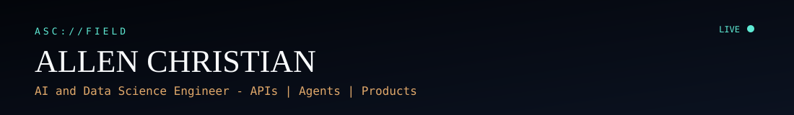
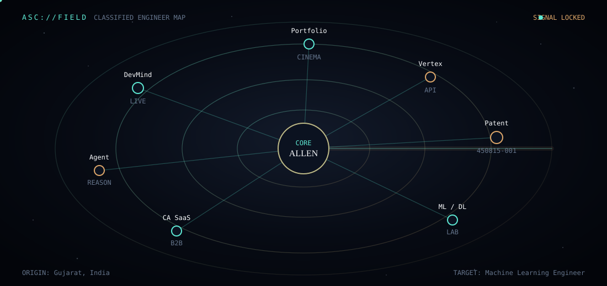
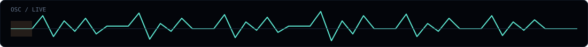

<div align="center">



<br/>

<!-- The thing almost nobody puts on a profile: a live constellation of your systems -->


<br/>



<br/>


<a href="https://portfolio-demo-tan-six.vercel.app/"></a>
<a href="https://www.linkedin.com/in/allen-christian-708545409/"></a>
<a href="mailto:allenschristian07@gmail.com"></a>

</div>

<br/>

<div align="center">

</div>

<br/>

<div align="center">

</div>

<br/>

## Node graph

Every blip on the field map is real work — from the [portfolio](https://portfolio-demo-tan-six.vercel.app/).

| Node | Class | Link |
|:--|:--|:--|
| **DevMind AI** | LIVE PRODUCT | [Open](https://devmind-ai-topaz.vercel.app/) · [Repo](https://github.com/allen745/devmind-ai) |
| **DevMind Agent** | REASONING | [Open](https://devmind-agent.onrender.com/) · [Repo](https://github.com/allen745/DEVMIND-AGENT) |
| **CA SaaS** | B2B · WIP | [Repo](https://github.com/allen745/ca-saas) |
| **Vertex** | CAREER API · WIP | [API](https://vertex-api-allen07.azurewebsites.net/) |
| **Patent 450815-001** | GOI DESIGN | [Repo](https://github.com/allen745/power-strike-) |
| **ML / DL Lab** | LEARNING | [ML](https://github.com/allen745/ml-models-portfolio) · [DL](https://github.com/allen745/dl-models-portfolio) |
| **Portfolio** | CINEMA | [Live](https://portfolio-demo-tan-six.vercel.app/) · [Source](https://github.com/allen745/portfolio-demo-) |

<br/>

<details>
<summary><b>Decode a node</b></summary>

<br/>

**DevMind** — AI developer toolkit: review, bugs, docs, complexity, commits. FastAPI + Groq + React.  
**Agent** — multi-step repo intelligence for Microsoft Agents League. LLaMA + Foundry IQ.  
**CA SaaS** — platform for practicing CAs: clients, document AI, notices, anomaly flags.  
**Vertex** — career intelligence API on Azure.  
**Patent** — spring-loaded piezoelectric striker, Govt of India design patent.  
**Lab** — classical ML + deep learning practice series (honest learning depth, not fake prod).

</details>

<br/>

<div align="center">

</div>

<br/>

## Frequency stack

```text
[delivery]   Git · GitHub · Vercel · ship end-to-end
[agents]     Groq · LLaMA · Foundry IQ · reasoning loops
[backend]    FastAPI · REST · Pydantic · JWT · PostgreSQL
[learning]   scikit-learn · TensorFlow · Keras · CV
[core]       Python · NumPy · Pandas · SQL
```

<div align="center">

</div>

<br/>

<div align="center">

</div>

<br/>

## Auth markers

| Marker | Proof |
|:--|:--|
| Patent | Govt of India Design Patent `450815-001` |
| Internship | Top 5 — InAmigos Foundation (SI85) |
| National | TCS Rural IT Quiz · AIKYAM SPEC Award |
| CTF | HackZero '26 — OWASP VIT Bhopal |
| Education | B.Tech AI and Data Science — ADIT, CVM University |

<br/>

<div align="center">

</div>

<br/>

## Telemetry

<div align="center">


</div>

<br/>

<div align="center">


</div>

<br/>

<div align="center">

</div>

<br/>

## Open channel

<div align="center">

[](https://portfolio-demo-tan-six.vercel.app/)
[](https://www.linkedin.com/in/allen-christian-708545409/)
[](mailto:allenschristian07@gmail.com)
[](https://github.com/allen745)

</div>

<br/>

<div align="center">

</div>
